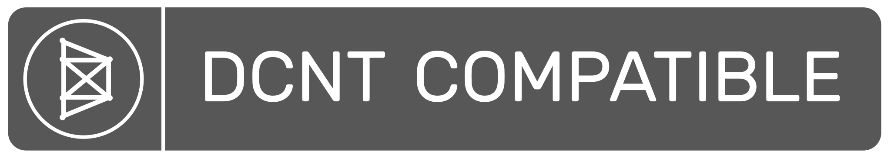
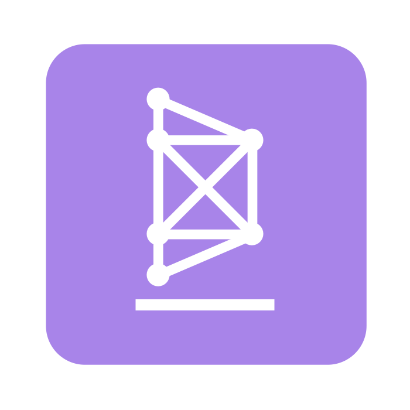

# DeCent-CLI

DeCent-CLI is a Node.js-compatible toolset for building, testing, validating, managing, and self-hosting Decentralized Web Apps (DWAs). The package is also available on NPM <a href="">here</a>.

NOTE: An implementation of a DCNT server is included in the package to provide DCNT peer connection signaling and a self-hosted SSL/TLS context for locally-installed DWAs. The server class presumably has unrealized security vulnerabilities, so exposing it to a public network directly, especially continuously, is probably unwise. The environment is intended for DWA development and testing.

## Contents
- <a href="#introduction">Introduction</a>
- <a href="#installation">Installation</a>
- <a href="#getting-started">Getting Started</a>
- <a href="#usage">Usage</a>
- <a href="#about">About</a>
- <a href="#contribute">Contribute</a>

## Introduction

DeCent-CLI is a command line interface application written in JavaScript for Node.js and/or Node.js-compatible environments. There are a few external dependencies on the *JSZIP* package, for extracting ZIP archives of downloaded DWAs, *pem* for generating self-signed certificates, and *ws* for WebSocket functionality. The CLI is intended to provide a simple, pain-free development experience for DWA developers by providing a toolset of shortcuts and conveniences for common tasks, as well as a testing environment for applications that rely on DCNT signaling to achieve peer connections.

The CLI offers three primary benefits:
1. **Test/Validate DWAs** - The CLI includes a tool to validate DWA packages, helping to ensure that the DWA ecosystem is standardized and interoperable. Testing framework coming soon.
2. **Install/Self-Host DWAs** - The CLI includes options to install DWAs locally for self-hosted access.
3. **Embedded DCNT server** - The CLI includes an embedded DCNT-compatible signaling server for use in testing DCNT-powered peer connections between browsers.

## Installation

Installation is easy using **git** and **npm**:

    $ git clone https://github.com/futurehood/DeCent-CLI
    $ cd DeCent-CLI
    $ npm install -g 
    
NOTE: Using the global installation flag (-g) is not required but recommended for convenience.

Once installed, the CLI application can be run from the ***decent-cli*** executable.

## Getting Started

Once DeCent-CLI has been installed, it can be run by calling the ***decent-cli*** executable:

    $ decent-cli

Running the executable without any arguments will bring up the command menu:

It's also possible to run the application with commands passed in as arguments. The following command will start the embedded DCNT server using the *default* profile:

    $ decent-cli server start

This command will start the server using a specific profile:

    $ decent-cli server start example-profile

Read the <a href="https://github.com/futurehood/DeCent-CLI/blob/main/readme/usage-guide.md#decent-cli-usage-guide">Usage Guide</a> for more information.

